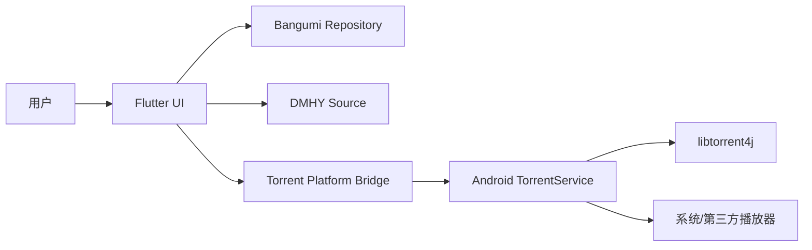

# 候选架构与阶段路线

## 状态说明

本文档是基于 2026-06-26 技术调研形成的候选方案，尚未经过用户最终确认。进入代码实现前，应先确认首期范围和关键取舍。

## 推荐总体架构

推荐采用 `Flutter UI + Android 原生下载服务` 的架构：

1. Flutter 负责页面、状态编排、Bangumi/DMHY 的业务入口和用户操作。
2. Bangumi 模块使用官方 OpenAPI 生成客户端，并由 Repository 封装业务语义。
3. DMHY 模块首期使用 RSS 搜索，按需解析详情页种子链接。
4. Torrent 模块由 Android Kotlin Foreground Service 承载，通过平台通道向 Flutter 暴露命令和状态。
5. 播放模块由 Android 原生侧负责 FileProvider/content URI 和 Intent 调起。

## 阶段拆分

### 阶段 0：Flutter 工程初始化

目标：

1. 初始化 Flutter Android 工程。
2. 建立目录结构、基础主题、路由、依赖管理和 lint。
3. 为每个独立模块创建 README。
4. 保留后续生成 Bangumi API 客户端和 Android 原生服务的目录边界。

建议产物：

1. `pubspec.yaml`
2. `lib/README.md`
3. `lib/app/README.md`
4. `lib/features/README.md`
5. `android/README.md` 或 Android 原生模块 README

### 阶段 1：Bangumi 登录与条目浏览

目标：

1. 接入 Bangumi OAuth 登录。
2. 安全保存 access token 和 refresh token。
3. 调用 `/v0/me` 展示用户信息。
4. 支持搜索动画条目和查看条目详情。
5. 支持用户收藏条目。

推荐实现：

1. 使用官方 OpenAPI 生成 `dart-dio` 客户端。
2. 使用 Repository 隔离生成代码和 UI。
3. 搜索默认筛选动画类型。
4. 加入搜索防抖、分页、错误提示和 429 退避。

待确认：

1. OAuth `client_secret` 是否由移动端保存，还是需要后端 token broker。
2. Bangumi OAuth 回调使用自定义 scheme 还是 App Links。

### 阶段 2：DMHY 搜索与资源选择

目标：

1. 支持按关键词搜索 DMHY RSS。
2. 展示标题、发布时间、发布人、分类、磁力链接状态。
3. 支持复制磁力链接。
4. 支持把磁力链接交给 Torrent 模块。
5. 按需解析详情页并下载 `.torrent` 文件。

推荐实现：

1. RSS 使用 `http` 加 `xml` 或 `dart_rss`。
2. 详情页使用 `html` 包解析 `.torrent` 链接。
3. 默认在关键词里附加 `sort_id:2` 搜索动画资源。
4. 所有下载动作都由用户显式点击触发。

待确认：

1. 首期是否需要展示资源大小、种子数、下载数和完成数。
2. 是否要加入 Anime Garden 作为非官方备用源。

### 阶段 3：Torrent 下载核心

目标：

1. Android 原生侧集成 `libtorrent4j`。
2. 支持添加 magnet 和 `.torrent` 文件。
3. 支持任务状态、暂停、恢复、删除。
4. 支持 metadata 获取后展示文件列表。
5. 支持完成后识别视频文件。

推荐实现：

1. Android Kotlin Foreground Service 承载下载任务。
2. MethodChannel 暴露命令接口。
3. EventChannel 推送状态快照。
4. Room/SQLite 保存任务、目录、暂停状态和 resume 数据。
5. 首期下载目录使用 APP 专属目录。

待确认：

1. 是否接受 Android 15 `dataSync` 前台服务额度导致的暂停和恢复体验。
2. 首期是否需要做种控制、限速、文件优先级和只下载最大视频文件。

### 阶段 4：播放与文件导出

目标：

1. 支持下载完成后调用系统或第三方播放器。
2. 通过 FileProvider 或 MediaStore 提供 `content://` URI。
3. 支持多个视频文件候选。
4. 后续可支持导出到公共媒体库或用户选择目录。

推荐实现：

1. 原生 Kotlin 播放桥接负责 MIME 判断、URI 授权和 Intent 调起。
2. Flutter 侧只展示视频列表和播放入口。
3. 首期不使用裸 `file://`，不申请 `MANAGE_EXTERNAL_STORAGE`。

## 首期最小闭环建议

为了尽快形成可验证闭环，建议首个开发里程碑只做：

1. Flutter 工程骨架。
2. Bangumi 登录、搜索和条目详情。
3. DMHY RSS 搜索并复制/提交磁力链接。
4. Android 原生 Torrent Service 的最小下载任务。
5. 下载完成后调起播放器。

收藏、进度、复杂过滤、做种策略、RSS 自动订阅、公共目录导出和高级下载设置可以在闭环跑通后逐步补齐。

## 关键风险

1. 移动端 Bangumi OAuth `client_secret` 安全策略需要尽早确认。
2. Android 15 对 `dataSync` Foreground Service 的时间限制会影响“长期常驻后台”体验。
3. Torrent 与 DMHY 资源聚合存在应用商店合规风险。
4. GPL 项目只能参考架构，不能直接复制代码。
5. DMHY RSS/HTML 不是强契约 API，需要做好字段缺失、域名变更和请求失败兜底。
