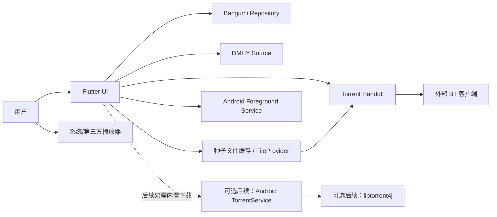

# 候选架构与阶段路线

## 状态说明

本文档是基于 2026-06-26 技术调研形成的候选方案。当前已确认的关键取舍是：首期只负责 `.torrent` 种子文件和 magnet 获取与交接，不内置 BT 视频内容下载器。

## 推荐总体架构

推荐采用 `Flutter UI + Android 外部 BT 客户端交接` 的首期架构：

1. Flutter 负责页面、状态编排、Bangumi/DMHY 的业务入口和用户操作。
2. Bangumi 模块使用官方 OpenAPI 生成客户端，并由 Repository 封装业务语义。
3. DMHY 模块首期使用 RSS 搜索，按需解析详情页种子链接。
4. Torrent 交接模块只负责 magnet 打开、magnet 复制、`.torrent` 种子文件下载、外部客户端直开和分享兜底；当前已通过成熟 Flutter 插件落地直开与分享双路径。
5. BT 视频内容下载由用户手机自己的外部 BT 客户端负责，APP 不管理下载进度、暂停恢复、做种、限速和下载目录。
6. 播放模块首期可以只调起系统/第三方播放器；如果视频由外部客户端下载完成，APP 需要用户手动选择本地视频后才能播放。
7. 后台常驻使用用户显式开启的 Android Foreground Service，当前提供持续通知、低频心跳、通知点击默认回到后台页、订阅命中时通知直达 DMHY 搜索、通知停止按钮、DMHY 订阅低频自动检查、前台最近摘要刷新和订阅结果回流 DMHY 搜索。
8. 如果未来明确要在 APP 内管理 BT 下载，再新增 Android 原生 Foreground Service 加 `libtorrent4j` 的后续阶段。

## 阶段拆分

### 阶段 0：Flutter 工程初始化（已完成）

目标：

1. 初始化 Flutter Android 工程。
2. 建立目录结构、基础主题、路由、依赖管理和 lint。
3. 为每个独立模块创建 README。
4. 保留后续生成 Bangumi API 客户端和 Android 原生服务的目录边界。

建议产物：

1. `pubspec.yaml`
2. `lib/README.md`
3. `lib/app/README.md`
4. `lib/features/README.md`
5. `android/README.md` 或 Android 原生模块 README

当前落地情况：

1. 已生成 Android-only Flutter 工程，包名前缀为 `com.railyw`。
2. 已建立 `lib/app`、`lib/features`、`lib/shared`、`android` 和 `test` 模块 README。
3. 已增加首页导航壳，覆盖 Bangumi、DMHY、种子交接、播放和后台常驻五个入口。
4. 已在 Android Manifest 中声明网络权限、前台服务权限、前台服务类型权限、magnet 查询、`.torrent` MIME 查询和 `video/*` 播放器查询。
5. 已加入 `go_router`、`flutter_riverpod`、`dio`、`flutter_secure_storage`、`url_launcher`、`path_provider`、`share_plus`、`file_selector`、`open_filex`、`flutter_foreground_task`、`xml` 和 `html` 作为后续阶段基础依赖。

### 阶段 1：Bangumi 登录与条目浏览

目标：

1. 接入 Bangumi OAuth 登录。
2. 安全保存 access token 和 refresh token。
3. 调用 `/v0/me` 展示用户信息。
4. 支持搜索动画条目和查看条目详情。
5. 支持用户收藏条目。

当前落地情况：

1. 已接入可配置 OAuth 登录，使用 `flutter_appauth` 调用 Bangumi `/oauth/authorize` 和 `/oauth/access_token`。
2. 已通过 `flutter_secure_storage` 保存 access token、refresh token、过期时间、token 类型和 scope。
3. 已接入 `/v0/me` 当前用户信息读取，并在 Bangumi 首页展示登录状态、用户昵称、用户名、头像、签名、刷新和退出入口。
4. 已接入公开动画条目搜索，使用 `POST /v0/search/subjects` 和 `filter.type: [2]`。
5. 已建立 Bangumi 条目模型、用户模型、OAuth token 模型、收藏模型、Dio API 客户端、Repository 抽象、Riverpod 搜索 Provider、详情 Provider、当前用户 Provider 和当前用户收藏 Provider。
6. 已在 Bangumi 首页提供关键词搜索 UI、输入防抖、排序菜单、搜索按钮即时提交、结果列表和搜索结果分页加载更多。
7. 已接入公开条目详情，使用 `GET /v0/subjects/{subject_id}`，支持从搜索结果进入详情页。
8. 已接入条目详情页个人收藏读取和修改，支持想看、看过、在看、搁置、抛弃、评分、短评和私有标记。
9. 已接入当前用户动画收藏列表读取，使用 `GET /v0/users/{username}/collections?subject_type=2`，并在 Bangumi 首页提供分页列表、状态筛选、刷新和加载更多。
10. 已接入动画章节观看状态同步，使用 `GET /v0/users/-/collections/{subject_id}/episodes?episode_type=...` 读取本篇、特别篇、OP、ED、PV、MAD 或其他章节收藏状态，并使用 `PATCH /v0/users/-/collections/{subject_id}/episodes` 更新单集状态或批量标记到第 N 话看过；详情页支持章节类型筛选、展开/收起当前已加载章节、加载更多章节，并在保存后按当前类型和已加载范围刷新进度。
11. 已接入条目详情页 DMHY 资源搜索联动，使用条目中文名优先生成关键词并跳转到 DMHY 动画分类 RSS 搜索。
12. 已为搜索、详情、当前用户信息、收藏读取和章节读取请求加入 429 `Retry-After` 退避重试一次，收藏写入和章节写入不自动重复提交。
13. 更多批量管理仍是后续工作。

推荐实现：

1. 使用官方 OpenAPI 生成 `dart-dio` 客户端。
2. 使用 Repository 隔离生成代码和 UI。
3. 搜索默认筛选动画类型。
4. 加入更细化的错误提示；429 退避已先覆盖 Bangumi 读取类请求。

待确认：

1. 当前移动端通过 `--dart-define` 注入 OAuth `client_secret`；发布前仍需确认是否改为后端 token broker。
2. 当前 Bangumi OAuth 回调使用自定义 scheme `com.railyw.anime_mobile_torrent:/oauth/bangumi`；发布前可继续评估 App Links。

### 阶段 2：DMHY 搜索与资源选择

目标：

1. 支持按关键词搜索 DMHY RSS。
2. 展示标题、发布时间、发布人、分类、磁力链接状态和从标题/简介提取的轻量资源标签。
3. 支持复制磁力链接。
4. 支持复制磁力链接，或把磁力链接交给外部 BT 客户端。
5. 按需解析详情页并下载 `.torrent` 种子文件。

推荐实现：

1. RSS 使用 `http` 加 `xml` 或 `dart_rss`。
2. 详情页使用 `html` 包解析 `.torrent` 链接。
3. 默认在关键词里附加 `sort_id:2` 搜索动画资源。
4. 所有下载动作都由用户显式点击触发。

当前落地情况：

1. 已接入 DMHY RSS 关键词搜索，默认使用动画分类 RSS `topics/rss/sort_id/2/rss.xml?keyword=...`。
2. 已建立 DMHY 资源模型、RSS XML 解析器、Dio RSS 客户端、Repository 抽象和 Riverpod 搜索 Provider。
3. 已在 DMHY 首页提供关键词搜索 UI、Bangumi 初始关键词自动搜索、动画分类开关和 RSS 结果列表。
4. 已支持从 RSS 结果复制 magnet 或通过系统外部应用打开 magnet。
5. 已支持按用户点击解析 DMHY 详情页 `.torrent` 链接，并把种子文件下载到 APP 临时目录、写入最近种子记录后优先直开外部 BT 客户端，直开失败时自动降级到系统分享面板。
6. 已在 DMHY 资源卡片中读取外部 BT 客户端能力检测结果，在用户点击前提示 `.torrent` 直开、分享导入、只可用 magnet 或未发现客户端状态，并把主按钮动态调整为“打开种子”“分享种子”或“复制磁力”。
7. 已从 DMHY RSS 标题和简介文本中提取字幕组、话数、分辨率、片源、编码、封装格式、字幕说明和文本中的大小标签，并在资源卡片中展示；RSS `enclosure.length` 不作为视频文件大小使用。
8. 已在前台 DMHY 搜索中按需解析 HTML 列表页，合并真实大小、種子、下載和完成统计；后台订阅检查关闭该增强以减少额外请求。
9. 已支持前台 DMHY 资源按发布时间、种子数、下载数、完成数或文件大小排序；统计缺失时保持 RSS 发布时间和原始顺序兜底。
10. 已为 DMHY RSS 搜索、详情页解析和 `.torrent` 文件下载请求加入 429 `Retry-After` 退避重试一次，所有动作仍由用户显式搜索或点击触发。

待确认：

1. 如果后续需要更强筛选，可在已解析的 DMHY HTML 统计基础上增加字幕组、分辨率、封装格式和资源大小区间过滤。
2. 是否要加入 Anime Garden 作为非官方备用源。

### 阶段 3A：外部 Torrent 客户端交接 MVP

目标：

1. 支持通过系统 Intent 打开 `magnet:` 链接。
2. 支持复制 magnet，作为无外部客户端或用户手动处理时的兜底。
3. 支持从 DMHY 详情页下载 `.torrent` 种子文件。
4. 支持直接打开 `.torrent` 种子文件给外部 BT 客户端，并在直开失败时通过系统分享面板兜底。
5. 支持检测无可用外部 BT 客户端时的错误提示和降级入口。
6. 明确不下载 BT 视频内容，不管理下载任务、下载进度、暂停恢复、做种、限速和下载目录。

推荐实现：

1. Flutter 侧优先用 `url_launcher` 尝试打开 magnet；若兼容性不足，再补 Android 原生平台桥。
2. `.torrent` 文件下载到 APP 专属缓存或文件目录，不写入公共下载目录。
3. Flutter 侧优先使用 `open_filex` 以 `application/x-bittorrent` MIME 直开 `.torrent`，兼容性不足时再补 Android 原生 FileProvider 平台桥。
4. 使用 `ACTION_VIEW` 打开 magnet 或 `.torrent`，使用 `ACTION_SEND` 分享 `.torrent` 作为兜底。
5. 在 Android manifest `<queries>` 中声明 `magnet` scheme 和 `application/x-bittorrent`，以支持 Android 11+ 包可见性查询。
6. 所有交接动作都由用户显式点击触发，不做自动下载和静默跳转。

当前落地情况：

1. 已通过 `url_launcher` 支持 `magnet:` 外部打开，并保留复制兜底。
2. 已通过 DMHY 详情页解析和 Dio 下载 `.torrent` 种子文件到 APP 临时目录。
3. 已抽象通用 `TorrentSeedFile`、`TorrentHandoffResult`、`TorrentHandoffRepository` 和 Riverpod Provider。
4. 已通过 `open_filex` 直接打开 `.torrent` 文件给外部 BT 客户端。
5. 已通过 `share_plus` 在直开失败时自动打开系统分享面板，作为外部客户端兼容兜底。
6. 已在种子交接页补充外部 BT 客户端兼容自检、失败处理和“不下载 BT 视频内容”的边界说明。
7. 已新增 Android MethodChannel，通过 PackageManager resolver 查询当前设备是否存在可处理 magnet、`.torrent` 直开和 `.torrent` 分享导入的外部客户端，并在种子交接页和 DMHY 资源卡片展示检测结果。
8. 已在种子交接页新增本机真实设备兼容实测记录，用户可以手动标记直开成功、分享成功、magnet 兜底成功或交接失败，并把最近记录保存在本机。
9. 已在种子交接页新增最近种子记录，用户可以重新打开或分享最近从 DMHY 下载过的 `.torrent` 文件。

待确认：

1. 首期是否需要主动推荐或引导安装外部 BT 客户端。
2. 不同 BT 客户端对 magnet、`.torrent`、`ACTION_VIEW` 和 `ACTION_SEND` 的兼容差异是否需要在本机实测记录之外建立跨设备、跨客户端的兼容性清单。
3. 是否需要把当前本机实测记录扩展为更细的结果类型，例如区分客户端已接收、客户端内解析失败、权限失败和用户取消。

### 阶段 3B：可选内置 Torrent 下载器

触发条件：

1. 产品重新要求 APP 内直接管理 BT 视频内容下载。
2. 用户需要下载进度、暂停恢复、任务列表、做种、限速或文件优先级。
3. 外部 BT 客户端交接无法满足核心体验。

目标：

1. Android 原生侧集成 `libtorrent4j`。
2. 支持添加 magnet 和 `.torrent` 文件。
3. 支持任务状态、暂停、恢复、删除。
4. 支持 metadata 获取后展示文件列表。
5. 支持完成后识别视频文件。

推荐实现：

1. Android Kotlin Foreground Service 承载下载任务。
2. MethodChannel 暴露命令接口。
3. EventChannel 推送状态快照。
4. Room/SQLite 保存任务、目录、暂停状态和 resume 数据。
5. 首期下载目录使用 APP 专属目录。

### 阶段 4：播放与文件导出

目标：

1. 支持用户手动选择本地视频文件后调用系统或第三方播放器。
2. 通过系统文件选择器或 MediaStore 获取用户授权的视频文件 URI。
3. 通过播放器 Intent 打开用户选择的视频文件。
4. 如果后续做内置下载器，再支持下载完成后自动识别多个视频文件候选。

当前落地情况：

1. 已接入 `file_selector`，通过系统文件选择器让用户显式选择本地视频文件。
2. 已接入 `open_filex`，把用户选择的视频文件交给系统或第三方播放器打开。
3. 已建立本地视频文件模型、视频 MIME 推断、播放器打开结果模型、播放仓库接口和 Riverpod Provider。
4. 已在播放首页展示已选视频文件名、路径、MIME 类型、大小、播放按钮和打开结果反馈。
5. 已在 Android Manifest `<queries>` 中声明 `ACTION_VIEW video/*`，支持 Android 11+ 包可见性查询。
6. 已在播放首页新增最近视频本机记录，用户可以快速选用最近手动选择过的视频，并可清空本机记录。
7. 当前不扫描外部 BT 客户端下载目录，不申请全文件访问权限，不实现内嵌播放器。

推荐实现：

1. 首期继续使用 `file_selector` 和 `open_filex` 作为成熟插件方案，避免自行手写文件选择器和播放 Intent。
2. 如果后续发现部分 Android 设备或播放器兼容性不足，再补 Kotlin 播放桥接，负责更细粒度的 MIME 判断、URI 授权和 Intent 调起。
3. 首期不申请 `MANAGE_EXTERNAL_STORAGE`，也不扫描外部 BT 客户端的下载目录。

### 阶段 5：后台常驻与订阅检查

目标：

1. 支持用户显式开启 Android 前台服务。
2. 服务运行时显示持续通知，用户可以回到应用或在应用内停止服务。
3. 提供低频心跳，为后续 DMHY RSS 订阅检查、追番更新提醒或下载交接提醒预留挂点。
4. 不在后台静默下载种子或视频内容。

当前落地情况：

1. 已接入 `flutter_foreground_task`，在 `lib/features/background` 中封装后台常驻状态、Repository、Riverpod 控制器和首页标签页。
2. 已在 `main.dart` 初始化 foreground task 通信端口，并使用 `WithForegroundTask` 处理服务运行时的返回键最小化行为。
3. 已在 Android Manifest 中声明 `FOREGROUND_SERVICE`、`FOREGROUND_SERVICE_DATA_SYNC` 和插件固定服务 `com.pravera.flutter_foreground_task.service.ForegroundService`。
4. 已提供“后台”首页标签页，支持启动、停止、刷新状态，并展示持续通知和低频心跳接入情况。
5. 已新增 `lib/features/subscriptions`，支持保存 DMHY RSS 订阅关键词、选择动画分类或全站范围、手动检查 RSS、后台低频自动检查，并在前台展示最近自动检查摘要和失败原因。
6. 已把订阅自动检查接入前台服务心跳：服务运行时按最小间隔读取关键词、检查 DMHY RSS，把成功或失败摘要写入本地记录，并通过持续通知展示检查摘要。
7. 已支持后台通知默认打开 `/?tab=background` 回到后台页；如果最近一次订阅自动检查命中资源且携带最新关键词，则通知点击会直接打开 `/?tab=dmhy&keyword=...&animeOnly=...` 进入 DMHY 搜索页；同时提供“停止后台”通知按钮请求停止前台服务。
8. 已支持从订阅关键词、手动检查结果和带最新命中关键词的自动检查摘要跳转到 DMHY 搜索页，并保留动画分类或全站搜索范围，后续 `.torrent` 下载仍由用户在 DMHY 页显式触发。

后续建议：

1. 继续评估是否需要额外的“查看后台”通知按钮，让命中资源时主通知点击直达 DMHY 搜索，同时仍保留一个明确入口回后台摘要页。
2. 按 Android 15 `dataSync` 限制继续评估订阅检查频率，避免把前台服务当作无限运行下载器。

## 首期最小闭环建议

为了尽快形成可验证闭环，建议首个开发里程碑只做：

1. Flutter 工程骨架。
2. Bangumi 登录、当前用户信息、搜索输入防抖、搜索结果分页、条目详情、我的动画收藏分页列表、单条收藏读写、动画章节状态同步、章节类型筛选、已加载章节展开查看、章节分页加载更多和批量标记到第 N 话看过。
3. DMHY RSS 搜索并复制/打开磁力链接，资源卡片展示轻量标题元数据标签。
4. Bangumi 条目详情页带标题跳转到 DMHY 自动搜索资源。
5. 按需解析 DMHY 详情页并下载 `.torrent` 种子文件，同时保留最近种子记录以便重试打开或分享。
6. 通过系统 Intent、分享或复制，把 magnet 或 `.torrent` 种子文件交给外部 BT 客户端。
7. 已提供手动选择本地视频、最近视频回选并调用播放器的入口，不自动追踪外部 BT 客户端的下载结果。
8. 已提供用户显式开启的 Android 前台服务后台常驻入口。
9. 已提供 DMHY RSS 订阅关键词保存、手动检查、后台低频自动检查、最近自动检查摘要入口、订阅关键词/检查结果回流 DMHY 搜索入口、后台通知回流入口，以及订阅命中通知直达 DMHY 搜索入口。

复杂过滤、更多批量管理、订阅通知交互、跨设备外部客户端兼容清单、公共目录导出和内置下载器可以在基础闭环跑通后逐步补齐。

## 关键风险

1. 移动端 Bangumi OAuth `client_secret` 安全策略需要尽早确认。
2. 首期不内置下载器会显著降低复杂度，但也意味着 APP 无法知道外部 BT 客户端的下载进度、完成状态和视频文件路径。
3. 不同外部 BT 客户端对 magnet、`.torrent`、`ACTION_VIEW` 和 `ACTION_SEND` 的兼容性可能不同，需要做好复制和分享兜底。
4. Torrent 与 DMHY 资源聚合存在应用商店合规风险。
5. GPL 项目只能参考架构，不能直接复制代码。
6. DMHY RSS/HTML 不是强契约 API，需要做好字段缺失、域名变更和请求失败兜底。
7. Android 15 对 `dataSync` Foreground Service 的时间限制会影响“长期常驻后台”体验，订阅检查和未来后台任务需要控制频率并避免过度承诺。
8. 如果后续恢复内置下载器，仍需要单独评估 BT 引擎、任务通知和 Foreground Service 类型。
