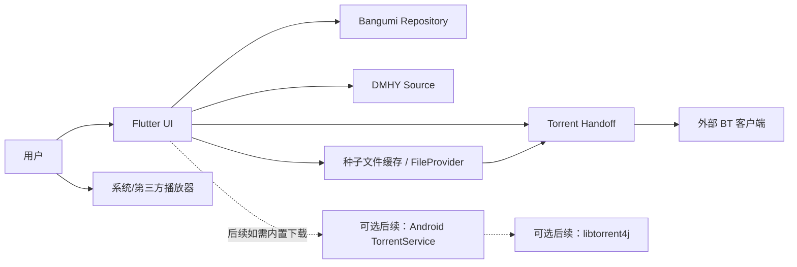

# 候选架构与阶段路线

## 状态说明

本文档是基于 2026-06-26 技术调研形成的候选方案。当前已确认的关键取舍是：首期只负责 `.torrent` 种子文件和 magnet 获取与交接，不内置 BT 视频内容下载器。

## 推荐总体架构

推荐采用 `Flutter UI + Android 外部 BT 客户端交接` 的首期架构：

1. Flutter 负责页面、状态编排、Bangumi/DMHY 的业务入口和用户操作。
2. Bangumi 模块使用官方 OpenAPI 生成客户端，并由 Repository 封装业务语义。
3. DMHY 模块首期使用 RSS 搜索，按需解析详情页种子链接。
4. Torrent 交接模块只负责 magnet 打开、magnet 复制、`.torrent` 种子文件下载、FileProvider 暴露和 Intent/分享交接。
5. BT 视频内容下载由用户手机自己的外部 BT 客户端负责，APP 不管理下载进度、暂停恢复、做种、限速和下载目录。
6. 播放模块首期可以只调起系统/第三方播放器；如果视频由外部客户端下载完成，APP 需要用户手动选择本地视频后才能播放。
7. 如果未来明确要在 APP 内管理 BT 下载，再新增 Android 原生 Foreground Service 加 `libtorrent4j` 的后续阶段。

## 阶段拆分

### 阶段 0：Flutter 工程初始化（已完成）

目标：

1. 初始化 Flutter Android 工程。
2. 建立目录结构、基础主题、路由、依赖管理和 lint。
3. 为每个独立模块创建 README。
4. 保留后续生成 Bangumi API 客户端和 Android 原生服务的目录边界。

建议产物：

1. `pubspec.yaml`
2. `lib/README.md`
3. `lib/app/README.md`
4. `lib/features/README.md`
5. `android/README.md` 或 Android 原生模块 README

当前落地情况：

1. 已生成 Android-only Flutter 工程，包名前缀为 `com.railyw`。
2. 已建立 `lib/app`、`lib/features`、`lib/shared`、`android` 和 `test` 模块 README。
3. 已增加首页导航壳，覆盖 Bangumi、DMHY、种子交接和播放四个入口。
4. 已在 Android Manifest 中声明网络权限、magnet 查询和 `.torrent` MIME 查询。
5. 已加入 `go_router`、`flutter_riverpod`、`dio`、`flutter_secure_storage`、`url_launcher`、`path_provider`、`share_plus`、`file_selector`、`xml` 和 `html` 作为后续阶段基础依赖。

### 阶段 1：Bangumi 登录与条目浏览

目标：

1. 接入 Bangumi OAuth 登录。
2. 安全保存 access token 和 refresh token。
3. 调用 `/v0/me` 展示用户信息。
4. 支持搜索动画条目和查看条目详情。
5. 支持用户收藏条目。

当前落地情况：

1. 已接入公开动画条目搜索，使用 `POST /v0/search/subjects` 和 `filter.type: [2]`。
2. 已建立 Bangumi 条目模型、Dio API 客户端、Repository 抽象和 Riverpod 搜索 Provider。
3. 已在 Bangumi 首页提供关键词搜索 UI 和结果列表。
4. 已接入公开条目详情，使用 `GET /v0/subjects/{subject_id}`，支持从搜索结果进入详情页。
5. OAuth 登录、`/v0/me` 和收藏修改仍是后续工作。

推荐实现：

1. 使用官方 OpenAPI 生成 `dart-dio` 客户端。
2. 使用 Repository 隔离生成代码和 UI。
3. 搜索默认筛选动画类型。
4. 加入搜索防抖、分页、错误提示和 429 退避。

待确认：

1. OAuth `client_secret` 是否由移动端保存，还是需要后端 token broker。
2. Bangumi OAuth 回调使用自定义 scheme 还是 App Links。

### 阶段 2：DMHY 搜索与资源选择

目标：

1. 支持按关键词搜索 DMHY RSS。
2. 展示标题、发布时间、发布人、分类、磁力链接状态。
3. 支持复制磁力链接。
4. 支持复制磁力链接，或把磁力链接交给外部 BT 客户端。
5. 按需解析详情页并下载 `.torrent` 种子文件。

推荐实现：

1. RSS 使用 `http` 加 `xml` 或 `dart_rss`。
2. 详情页使用 `html` 包解析 `.torrent` 链接。
3. 默认在关键词里附加 `sort_id:2` 搜索动画资源。
4. 所有下载动作都由用户显式点击触发。

当前落地情况：

1. 已接入 DMHY RSS 关键词搜索，默认使用动画分类 RSS `topics/rss/sort_id/2/rss.xml?keyword=...`。
2. 已建立 DMHY 资源模型、RSS XML 解析器、Dio RSS 客户端、Repository 抽象和 Riverpod 搜索 Provider。
3. 已在 DMHY 首页提供关键词搜索 UI、动画分类开关和 RSS 结果列表。
4. 已支持从 RSS 结果复制 magnet 或通过系统外部应用打开 magnet。
5. 详情页 `.torrent` 链接解析和种子文件下载仍是后续工作。

待确认：

1. 首期是否需要展示资源大小、种子数、下载数和完成数。
2. 是否要加入 Anime Garden 作为非官方备用源。

### 阶段 3A：外部 Torrent 客户端交接 MVP

目标：

1. 支持通过系统 Intent 打开 `magnet:` 链接。
2. 支持复制 magnet，作为无外部客户端或用户手动处理时的兜底。
3. 支持从 DMHY 详情页下载 `.torrent` 种子文件。
4. 支持通过 FileProvider `content://` URI 打开或分享 `.torrent` 种子文件。
5. 支持检测无可用外部 BT 客户端时的错误提示和降级入口。
6. 明确不下载 BT 视频内容，不管理下载任务、下载进度、暂停恢复、做种、限速和下载目录。

推荐实现：

1. Flutter 侧优先用 `url_launcher` 尝试打开 magnet；若兼容性不足，再补 Android 原生平台桥。
2. `.torrent` 文件下载到 APP 专属缓存或文件目录，不写入公共下载目录。
3. Android 原生侧通过 FileProvider 暴露 `content://` URI，并设置 `application/x-bittorrent` MIME。
4. 使用 `ACTION_VIEW` 打开 magnet 或 `.torrent`，使用 `ACTION_SEND` 分享 `.torrent` 作为兜底。
5. 在 Android manifest `<queries>` 中声明 `magnet` scheme 和 `application/x-bittorrent`，以支持 Android 11+ 包可见性查询。
6. 所有交接动作都由用户显式点击触发，不做自动下载和静默跳转。

待确认：

1. 首期是否需要主动推荐或引导安装外部 BT 客户端。
2. 不同 BT 客户端对 magnet、`.torrent`、`ACTION_VIEW` 和 `ACTION_SEND` 的兼容差异是否需要建立兼容性清单。

### 阶段 3B：可选内置 Torrent 下载器

触发条件：

1. 产品重新要求 APP 内直接管理 BT 视频内容下载。
2. 用户需要下载进度、暂停恢复、任务列表、做种、限速或文件优先级。
3. 外部 BT 客户端交接无法满足核心体验。

目标：

1. Android 原生侧集成 `libtorrent4j`。
2. 支持添加 magnet 和 `.torrent` 文件。
3. 支持任务状态、暂停、恢复、删除。
4. 支持 metadata 获取后展示文件列表。
5. 支持完成后识别视频文件。

推荐实现：

1. Android Kotlin Foreground Service 承载下载任务。
2. MethodChannel 暴露命令接口。
3. EventChannel 推送状态快照。
4. Room/SQLite 保存任务、目录、暂停状态和 resume 数据。
5. 首期下载目录使用 APP 专属目录。

### 阶段 4：播放与文件导出

目标：

1. 支持用户手动选择本地视频文件后调用系统或第三方播放器。
2. 通过系统文件选择器或 MediaStore 获取用户授权的视频文件 URI。
3. 通过播放器 Intent 打开用户选择的视频文件。
4. 如果后续做内置下载器，再支持下载完成后自动识别多个视频文件候选。

推荐实现：

1. 原生 Kotlin 播放桥接负责 MIME 判断、URI 授权和 Intent 调起。
2. Flutter 侧首期只提供手动选择视频和播放入口。
3. 首期不使用裸 `file://`，不申请 `MANAGE_EXTERNAL_STORAGE`，也不扫描外部 BT 客户端的下载目录。

## 首期最小闭环建议

为了尽快形成可验证闭环，建议首个开发里程碑只做：

1. Flutter 工程骨架。
2. Bangumi 登录、搜索和条目详情。
3. DMHY RSS 搜索并复制/打开磁力链接。
4. 按需解析 DMHY 详情页并下载 `.torrent` 种子文件。
5. 通过系统 Intent、分享或复制，把 magnet 或 `.torrent` 种子文件交给外部 BT 客户端。
6. 提供手动选择本地视频并调用播放器的入口，不自动追踪外部 BT 客户端的下载结果。

收藏、进度、复杂过滤、RSS 自动订阅、外部客户端兼容性清单、公共目录导出和内置下载器可以在闭环跑通后逐步补齐。

## 关键风险

1. 移动端 Bangumi OAuth `client_secret` 安全策略需要尽早确认。
2. 首期不内置下载器会显著降低复杂度，但也意味着 APP 无法知道外部 BT 客户端的下载进度、完成状态和视频文件路径。
3. 不同外部 BT 客户端对 magnet、`.torrent`、`ACTION_VIEW` 和 `ACTION_SEND` 的兼容性可能不同，需要做好复制和分享兜底。
4. Torrent 与 DMHY 资源聚合存在应用商店合规风险。
5. GPL 项目只能参考架构，不能直接复制代码。
6. DMHY RSS/HTML 不是强契约 API，需要做好字段缺失、域名变更和请求失败兜底。
7. 如果后续恢复内置下载器，Android 15 对 `dataSync` Foreground Service 的时间限制仍会影响“长期常驻后台”体验。
